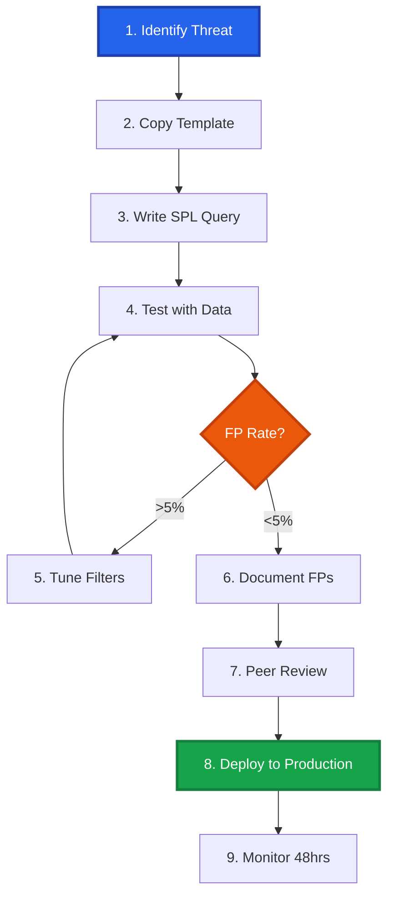

# Splunk SPL Detection Library

<div align="center">


[](https://attack.mitre.org/)
[]()

**Production-Ready SPL Correlation Searches for Splunk Enterprise Security**

*Curated by Mathan | Senior Security Engineer*

[🚀 Quick Start](#-quick-start) • [📁 Categories](#-detection-categories) • [📖 Documentation](#-detection-engineering-workflow) • [🤝 Contributing](#-contributing)

<!-- SEO: Splunk detection rules, SPL queries, correlation searches, SIEM analytics, threat detection, Splunk Enterprise Security, security monitoring, SOC automation, threat hunting, incident detection, MITRE ATT&CK Splunk, detection engineering, security operations, log analysis, Splunk use cases, notable events, risk-based alerting, CIM compliance, security content -->

</div>

---

## 📋 Overview

A comprehensive collection of **production-tested Splunk SPL detection rules** for Enterprise Security. Each detection is:

✅ **Battle-tested** - Validated across enterprise environments  
✅ **Low noise** - Tuned for <5% false positive rate  
✅ **MITRE-mapped** - Aligned to ATT&CK framework  
✅ **Response-ready** - Includes investigation playbooks  
✅ **CIM-compliant** - Leverages Common Information Model  

### Who This Is For

| Role | Use Case |
|------|----------|
| **Detection Engineers** | Build and deploy correlation searches |
| **SOC Analysts** | Investigate alerts and understand detection logic |
| **Threat Hunters** | Proactive hunting with proven queries |
| **Splunk Administrators** | Manage ES content and data models |

---

## 📁 Detection Categories

Organized into **8 practical categories** covering the full attack lifecycle:

<table>
<tr>
<td width="25%" align="center">
<h3>🔐 Authentication</h3>
<b>Login Attacks & Access Abuse</b><br/>
<sub>Brute Force • Password Spray • MFA Bypass</sub>
</td>
<td width="25%" align="center">
<h3>💻 Endpoint</h3>
<b>Host-Based Threats</b><br/>
<sub>Malware • Persistence • Process Injection</sub>
</td>
<td width="25%" align="center">
<h3>🌐 Network</h3>
<b>Network-Based Threats</b><br/>
<sub>C2 • Lateral Movement • Port Scanning</sub>
</td>
<td width="25%" align="center">
<h3>☁️ Cloud</h3>
<b>Cloud Platform Security</b><br/>
<sub>AWS • Azure • GCP Misconfigs</sub>
</td>
</tr>
<tr>
<td width="25%" align="center">
<h3>📧 Mail</h3>
<b>Email-Based Threats</b><br/>
<sub>Phishing • BEC • Malicious Attachments</sub>
</td>
<td width="25%" align="center">
<h3>🌍 Web</h3>
<b>Web Application Attacks</b><br/>
<sub>SQLi • Web Shells • XSS</sub>
</td>
<td width="25%" align="center">
<h3>📊 Data</h3>
<b>Data Loss & Exfiltration</b><br/>
<sub>DLP • Insider Threats • Mass Downloads</sub>
</td>
<td width="25%" align="center">
<h3>👤 Identity</h3>
<b>IAM & Privilege Abuse</b><br/>
<sub>Privilege Escalation • Role Changes</sub>
</td>
</tr>
</table>

---

## 🚀 Quick Start

### Prerequisites

- Splunk Enterprise Security 7.0+
- Required Technical Add-ons (TAs):
  - Splunk Add-on for Microsoft Windows
  - Splunk Add-on for AWS (if using Cloud detections)
  - Platform-specific TAs for your environment
- Accelerated CIM data models: Authentication, Endpoint, Network Traffic


### Deploy a Detection

**Method 1: Manual (Splunk Web UI)**

1. Navigate to **Content → Content Management** in Splunk ES
2. Click **Create New Content → Correlation Search**
3. Copy the SPL query from any detection file
4. Configure:
   - Schedule: `*/5 * * * *` (every 5 minutes)
   - Earliest/Latest: `-10m` to `now`
   - Trigger condition: `Number of Results > 0`
   - Throttle: `1 hour` per `user/dest`
5. Set Notable Event fields and severity
6. Save and enable

**Method 2: REST API**

```bash
curl -k -u admin:password \
  https://splunk-server:8089/servicesNS/nobody/SplunkEnterpriseSecuritySuite/saved/searches \
  -d name="T1110 - Brute Force Login Detection" \
  -d search='<SPL query>' \
  -d cron_schedule="*/5 * * * *" \
  -d actions="notable"
```

---

## 📖 Detection Engineering Workflow

### Step-by-Step Process



### 1. Identify the Threat

Choose a MITRE ATT&CK technique relevant to your environment:

- Review threat intelligence feeds
- Analyze recent incident data
- Consult with IR team on gaps

**Example:** T1110 (Brute Force)

### 2. Copy the Template

```bash
# Standard Production Alert (MITRE Aligned)
cp templates/TEMPLATE_Standard_Alert.spl rules/Authentication/T1110_Brute_Force.spl

# Threat Hunting Hypothesis
cp templates/TEMPLATE_Threat_Hunting.spl rules/Hunting/Hunt_T1110_Anomalies.spl

# Statistical Anomaly Detection
cp templates/TEMPLATE_Anomaly_Detection.spl rules/Anomaly/T1110_Baseline_Deviation.spl
```

### 3. Write the SPL Query

Leverage CIM-compliant fields for portability:

```spl
index=security sourcetype=WinEventLog:Security EventCode IN (4625, 4624)
| eval action=case(
    EventCode=4625, "failure",
    EventCode=4624, "success",
    1=1, "unknown"
)
| stats 
    count(eval(action="failure")) as failed_attempts,
    count(eval(action="success")) as successful_attempts,
    values(src_ip) as src_ips,
    earliest(_time) as first_seen,
    latest(_time) as last_seen
    by user, dest
| where failed_attempts >= 5 AND successful_attempts >= 1
| eval 
    risk_score = case(
        failed_attempts >= 20, 90,
        failed_attempts >= 10, 70,
        failed_attempts >= 5, 50
    ),
    severity = case(
        risk_score >= 80, "CRITICAL",
        risk_score >= 60, "HIGH",
        1=1, "MEDIUM"
    )
```

<details>
<summary><b>💡 SPL Best Practices</b></summary>

**Performance Optimization: `tstats` vs `index`**

| Feature | `tstats` (Metadata Search) | `index` (Raw Event Search) |
| :--- | :--- | :--- |
| **Speed** | ⚡ **Extremely Fast** (100x+ faster) | 🐢 **Slow** (Linear scan) |
| **Mechanism** | Scans `.tsidx` files (indexed fields only) | Retrieves raw events, decompresses, extracts fields |
| **Pros** | • Blazing fast for aggregations<br>• Low resource usage<br>• Ideal for long timeframes (30d+) | • Access to `_raw` data<br>• Can search non-indexed fields<br>• Supports regex on raw text |
| **Cons** | • Cannot see `_raw` payload<br>• Requires Data Models or indexed fields<br>• "Summariesonly" lag (if accelerated) | • High CPU/IO usage<br>• Slow over long timeframes<br>• Impacted by "noisy" data |

**Recommendation:** Always start with `tstats` for detection logic (filtering/aggregation). Only use `index` searches when you need to inspect the raw payload or extract fields at search time.

```spl
# ✅ GOOD - Uses tstats (Metadata Search)
| tstats summariesonly=true count from datamodel=Authentication
  where Authentication.action="failure" by Authentication.user

# ❌ AVOID - Uses index (Full Event Scan)
index=* | search action="failure" | stats count by user
```

**CIM Compliance:**
```spl
# Use standardized field names
- user, src_user, dest_user (not username, loginname)
- src, dest (not source_ip, destination_ip)
- action (values: success, failure, unknown)
```

</details>

### 4. Test with Historical Data

```spl
# Run against 7-30 days
index=security sourcetype=WinEventLog:Security earliest=-30d latest=now
| [your detection query]
| stats count
```

**Validation Metrics:**
- Total alerts generated
- Unique users/hosts affected
- Query execution time (<30 seconds ideal)
- Data volume processed

### 5. Tune for Your Environment

Add exclusions and adjust thresholds:

```spl
# Exclude known service accounts
| where NOT (user IN ("svc_backup", "svc_monitoring", "admin_service"))

# Exclude admin workstations
| where NOT (dest IN ("admin-jumpbox-01", "admin-ws-*"))

# Adjust threshold for environment size
| where failed_attempts >= 10  # Increased from 5 for large environment
```

**Target:** False positive rate < 5%

### 6. Document Everything

Update the template sections:

- **Known False Positives** - Service accounts, admin activities
- **Tuning Recommendations** - Threshold guidance per environment size
- **Testing Results** - FP rate, query performance
- **Response Guidance** - Investigation steps, escalation criteria

### 7. Peer Review

Have another detection engineer verify:

- [ ] Query logic is sound and efficient
- [ ] MITRE mapping is accurate
- [ ] False positive rate is acceptable
- [ ] Response guidance is actionable
- [ ] CIM compliance (where applicable)
- [ ] No hardcoded values (use macros/lookups)

### 8. Deploy to Production

1. Create correlation search in ES
2. Set appropriate schedule (typically every 5 minutes)
3. Configure notable event:
   - Severity mapping
   - Owner/Status defaults
   - Drilldown searches
4. Enable throttling to prevent alert fatigue
5. Document in CMDB/wiki

### 9. Monitor Performance

Track for first 48 hours:

```spl
# Alert volume
index=notable sourcetype=stash search_name="T1110*"
| timechart span=1h count

# Query performance
index=_audit action=search info=completed savedsearch_name="T1110*"
| stats avg(total_run_time) as avg_runtime
```

---

## 📊 Advanced Features

### Risk-Based Alerting (RBA)

Integrate with Splunk's Risk Framework for context-aware alerting:

```spl
| eval risk_object=user,
       risk_object_type="user",
       risk_score=50,
       risk_message="Brute force login detected for " + user
| collect index=risk sourcetype=risk_event
```

**Aggregate Risk Scoring:**
- Base score per detection
- Accumulates over time window
- Triggers incident at threshold (e.g., 100 in 24h)

### Notable Event Enrichment

```spl
| eval 
    rule_name="T1110 - Brute Force Login",
    rule_id="SPL-001",
    mitre_tactic="Credential Access",
    mitre_technique_id="T1110",
    asset=dest,
    identity=user,
    urgency=severity
| collect index=notable_events sourcetype=stash
```

### Correlation Examples

**Chain Multiple Detections:**

```spl
# Step 1: Brute force attempt (SPL-001)
# Step 2: Successful login from same IP (SPL-002)
# Step 3: Privilege escalation (SPL-003)

index=notable
| stats values(search_name) as detections, 
        earliest(_time) as first_seen,
        latest(_time) as last_seen
    by user
| where mvcount(detections) > 2
| eval attack_chain="Multi-stage attack detected"
```

---

## 🎓 Best Practices & Guidelines

### Query Performance

**Use Data Models:**
```spl
| tstats summariesonly=true count from datamodel=Authentication
  where Authentication.action="failure"
  by Authentication.user, Authentication.src
  span=5m
```

**Benefits:**
- 100x+ faster than raw searches
- Accelerated summaries
- CIM-normalized fields

### CIM Compliance

Map to Common Information Model for portability:

| CIM Data Model | Use Case | Key Fields |
|----------------|----------|------------|
| Authentication | Login events | user, src, dest, action |
| Endpoint | Process/file | process, parent_process, file_path |
| Network_Traffic | Network connections | src_ip, dest_ip, dest_port |
| Change | Config changes | object, change_type, result |

### Alerting Strategy

**Tiered Severity:**
- **Critical** - Active exploitation, confirmed C2
- **High** - Likely malicious, requires immediate response
- **Medium** - Suspicious, investigate within SLA
- **Low** - Anomalous, log for correlation

**Throttling:**
- Per user: Prevent duplicate alerts for same user
- Per asset: Group alerts from same system
- Time-based: Suppress for X minutes after first alert

---

## 🧪 Testing & Validation

### Automated Testing

**Recommended Tool:** [Event-Horizon](https://github.com/PrototypePrime/Event-Horizon)

Use **Event-Horizon** to generate production-quality security logs for validation:
- **Realistic Data:** Generate logs for 80+ technologies (Palo Alto, Windows, AWS, etc.).
- **Golden Master Templates:** Ensure 100% format accuracy for testing field extractions.
- **AI Attack Simulation:** Orchestrate coordinated kill chains to validate correlation rules.
- **Dashboard Validation:** Populate dashboards with realistic traffic to ensure no "No results found" errors.

### Automated Testing

**Recommended Tool:** [Event-Horizon](https://github.com/PrototypePrime/Event-Horizon)

Use **Event-Horizon** to generate production-quality security logs for validation:
- **Realistic Data:** Generate logs for 80+ technologies (Palo Alto, Windows, AWS, etc.).
- **Golden Master Templates:** Ensure 100% format accuracy for testing field extractions.
- **AI Attack Simulation:** Orchestrate coordinated kill chains to validate correlation rules.
- **Dashboard Validation:** Populate dashboards with realistic traffic to ensure no "No results found" errors.

```bash
# Example: Generate 100 Windows Security Logs
python main.py --sourcetype WinEventLog:Security --count 100
```

### Manual Validation Checklist

For each detection:

- [ ] Query executes without syntax errors
- [ ] Returns results on historical data (if threat present)
- [ ] Does NOT trigger on benign activity
- [ ] Execution time < 30 seconds
- [ ] Notable event created in ES
- [ ] Drilldown searches work
- [ ] Alert fields populated correctly
- [ ] Throttling behaves as expected

### Test Query Template

```spl
| makeresults count=10
| eval 
    EventCode=4625, 
    user="test_user", 
    dest="test-host", 
    action="failure",
    _time=relative_time(now(), "-" + random() % 60 + "s")
| append 
    [| makeresults count=1 
     | eval EventCode=4624, user="test_user", dest="test-host", action="success"]
| [Insert your detection query]
```

---

## 📈 Monitoring Detection Health

### Key Metrics Dashboard

```spl
# Alert Volume Trends
index=notable
| timechart span=1d count by search_name

# False Positive Rate
index=notable
| stats count as total, 
        sum(eval(match(comment, "(?i)false.*positive"))) as fp
    by search_name
| eval fp_rate=round(100*fp/total, 2)
| sort - fp_rate

# Query Performance
index=_audit action=search info=completed search_type=scheduled
| stats avg(total_run_time) as avg_time,
        max(total_run_time) as max_time
    by savedsearch_name
| where avg_time > 30
```

### Monthly Review Checklist

- [ ] Review alert volume trends
- [ ] Analyze false positive patterns
- [ ] Update exclusions based on environment changes
- [ ] Refresh threat intelligence IOCs
- [ ] Validate data source availability
- [ ] Update MITRE technique mappings
- [ ] Retire deprecated detections

---

## 🤝 Contributing

We welcome high-quality detection contributions!

### Contribution Guidelines

1. **Fork** this repository
2. **Create** a feature branch (`git checkout -b detection/T1234-new-rule`)
3. **Add** your detection using the template
4. **Test** thoroughly and document results
5. **Commit** changes (`git commit -m 'Add T1234 detection'`)
6. **Push** to branch (`git push origin detection/T1234-new-rule`)
7. **Submit** Pull Request

### Submission Requirements

✅ **Template compliance** - Use `TEMPLATE_Standard_Alert.spl` for production rules  
✅ **Testing documentation** - Include test results (TP/FP counts)  
✅ **Environment notes** - Document environment-specific tuning  
✅ **Screenshots** - Add example alert screenshots  
✅ **MITRE mapping** - Accurate technique/tactic IDs  

**Pull Request Template:**

```markdown
## Detection Details
- **Name:** [Detection Name]
- **Category:** [Authentication/Endpoint/etc.]
- **MITRE Technique:** T####
- **Severity:** [LOW/MEDIUM/HIGH/CRITICAL]

## Testing Results
- Historical data period: [7/14/30 days]
- Total alerts: ###
- True positives: ###
- False positives: ###
- **FP Rate:** #%

## Notable Tuning
- [Any environment-specific adjustments made]

## Screenshots
[Add alert example screenshot]
```

---

## 📚 Resources

### Splunk Documentation
- [SPL Reference](https://docs.splunk.com/Documentation/Splunk/latest/SearchReference)
- [Enterprise Security Guide](https://docs.splunk.com/Documentation/ES/latest)
- [Common Information Model](https://docs.splunk.com/Documentation/CIM/latest)
- [Data Model Reference](https://docs.splunk.com/Documentation/CIM/latest/User/DataModelReference)

### Detection Engineering
- [MITRE ATT&CK Framework](https://attack.mitre.org/)
- [Sigma Rules Repository](https://github.com/SigmaHQ/sigma)
- [Atomic Red Team](https://github.com/redcanaryco/atomic-red-team)
- [Splunk Security Research](https://research.splunk.com/)

### Learning Resources
- [Splunk Security Essentials](https://splunkbase.splunk.com/app/3435/)
- [Boss of the SOC](https://www.splunk.com/en_us/blog/security/bots.html)
- [Detection Engineering Playlist](https://www.youtube.com/playlist?list=PLrJGwAG1U62VXw_B-n6KuHEbrLs5F1d2v)

---

## 👤 About

### Author

**PrototypePrime (Mathan Subbiah)**  
*Senior Security Engineer | Detection Engineering Specialist*

Focused on building scalable detection systems and security tooling that accelerate threat detection, validation, and training workflows. Core mission: significantly reduce adversary dwell time through proactive, high-fidelity detections.

[](https://github.com/PrototypePrime)
[](https://www.linkedin.com/in/mathan-subbiah-0bb47aa8/)
[](mailto:mathan1702@gmail.com)

### Related Projects

**Detection Libraries:**
- [Microsoft Defender KQL Detection](https://github.com/PrototypePrime/Microsoft_Defender_KQL_Detection)
- [Cortex XDR XQL Detection](https://github.com/PrototypePrime/Cortex_XDR_XQL_Detection)

**Security Tools:**
- [Event-Horizon](https://github.com/PrototypePrime/Event-Horizon) - Production-quality security log generator (80+ platforms)

---

## 📞 Support

- **Issues:** [GitHub Issues](https://github.com/PrototypePrime/Splunk_SPL_Detection/issues)
- **Discussions:** [GitHub Discussions](https://github.com/PrototypePrime/Splunk_SPL_Detection/discussions)
- **Email:** mathan1702@gmail.com

## 📄 License

MIT License - see [LICENSE](LICENSE) file for details.

---

<div align="center">

### ⭐ Star This Repository!

*If these detections help your SOC, please star this repo and share with the community*

**Part of the PrototypePrime Detection Engineering Collection**


</div>
