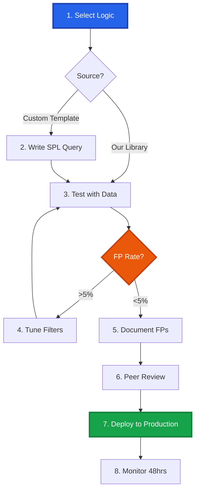

# Splunk SPL Detection Library

<div align="center">


[](https://attack.mitre.org/)
[]()

**Production-Ready Detection Logic & Engineering Toolkit**

*Curated by Mathan | Senior Security Engineer*

[🚀 Quick Start](#-quick-start) • [📁 Categories](#-detection-categories) • [📖 Documentation](#-detection-engineering-workflow) • [🤝 Contributing](#-contributing)

<!-- SEO: Splunk detection rules, SPL queries, correlation searches, SIEM analytics, threat detection, Splunk Enterprise Security, security monitoring, SOC automation, threat hunting, incident detection, MITRE ATT&CK Splunk, detection engineering, security operations, log analysis, Splunk use cases, notable events, risk-based alerting, CIM compliance, security content -->

</div>

---

## 📋 Overview

This repository provides **production-ready detection rules** and **detection engineering methodology**:

1.  **📚 Production Detection Library**: 50+ battle-tested SPL correlation searches ready for immediate deployment in your Splunk environment.
2.  **🛠️ Detection Engineering Reference**: Proven patterns and examples demonstrating professional detection development, testing, and documentation standards.

**Repository Value:** *Deploy our detection logic as-is, adapt it to your environment, or use our proven patterns as references when building your own custom detections.*

### Key Features
✅ **Battle-tested** - Validated across enterprise environments  
✅ **Low noise** - Tuned for <5% false positive rate  
✅ **MITRE-mapped** - Aligned to ATT&CK framework  
✅ **Response-ready** - Includes investigation playbooks  
✅ **CIM-compliant** - Leverages Common Information Model

---

## 📁 Detection Categories

Organized into **8 practical categories** covering the full attack lifecycle:

<table>
<tr>
<td width="25%" align="center">
<h3>🔐 Authentication</h3>
<b>Login Attacks & Access Abuse</b><br/>
<sub>Brute Force • Password Spray • MFA Bypass</sub>
</td>
<td width="25%" align="center">
<h3>💻 Endpoint</h3>
<b>Host-Based Threats</b><br/>
<sub>Malware • Persistence • Process Injection</sub>
</td>
<td width="25%" align="center">
<h3>🌐 Network</h3>
<b>Network-Based Threats</b><br/>
<sub>C2 • Lateral Movement • Port Scanning</sub>
</td>
<td width="25%" align="center">
<h3>☁️ Cloud</h3>
<b>Cloud Platform Security</b><br/>
<sub>AWS • Azure • GCP Misconfigs</sub>
</td>
</tr>
<tr>
<td width="25%" align="center">
<h3>📧 Mail</h3>
<b>Email-Based Threats</b><br/>
<sub>Phishing • BEC • Malicious Attachments</sub>
</td>
<td width="25%" align="center">
<h3>🌍 Web</h3>
<b>Web Application Attacks</b><br/>
<sub>SQLi • Web Shells • XSS</sub>
</td>
<td width="25%" align="center">
<h3>📊 Data</h3>
<b>Data Loss & Exfiltration</b><br/>
<sub>DLP • Insider Threats • Mass Downloads</sub>
</td>
<td width="25%" align="center">
<h3>👤 Identity</h3>
<b>IAM & Privilege Abuse</b><br/>
<sub>Privilege Escalation • Role Changes</sub>
</td>
</tr>
</table>

---

## 🚀 Quick Start

### Prerequisites
- Splunk Enterprise Security 7.0+
- Required Technical Add-ons (TAs) for your data sources
- Accelerated CIM data models (Authentication, Endpoint, Network Traffic)

### How to Use This Library

#### Option A: Deploy Production Rules (Recommended) ⚡
1.  **Browse** the detection categories above (e.g., `Authentication/T1110_Brute_Force.spl`).
2.  **Copy** the production-ready SPL query.
3.  **Test** in your Splunk environment to validate data visibility.
4.  **Deploy** as a Correlation Search in Enterprise Security.

#### Option B: Adapt for Your Environment (Flexible) 🛠️
1.  **Start** with a production rule from the library.
2.  **Customize** for your environment:
    *   Adjust thresholds based on your baseline
    *   Add environment-specific exclusions
    *   Modify field names to match your data model
3.  **Reference** the `templates/` directory for detection pattern examples.

#### Option C: Contribute Back (Community) 🤝
1.  **Fork** this repository.
2.  **Improve** existing rules or add new detection logic.
3.  **Submit** a Pull Request to share your work with the community.

---

## 📖 Detection Engineering Workflow

Whether you are using our rules or building your own, we recommend this standard workflow:



### 1. The Logic Core (SPL)
Our rules are built for performance. We prioritize `tstats` for speed and standardized CIM fields for portability.

**Example Logic:**
```spl
index=security sourcetype=WinEventLog:Security EventCode IN (4625, 4624)
| eval action=case(
    EventCode=4625, "failure",
    EventCode=4624, "success",
    1=1, "unknown"
)
| stats 
    count(eval(action="failure")) as failed_attempts,
    count(eval(action="success")) as successful_attempts
    by user, dest
| where failed_attempts >= 5 AND successful_attempts >= 1
```

### 2. Testing & Validation
Before deploying, validate the logic using **Event-Horizon**.

**Recommended Tool:** [Event-Horizon](https://github.com/PrototypePrime/Event_Horizon)

Use **Event-Horizon** to generate production-quality security logs for validation:
- **Realistic Data:** Generate logs for 80+ technologies (Palo Alto, Windows, AWS, etc.).
- **Golden Master Templates:** Ensure 100% format accuracy for testing field extractions.
- **AI Attack Simulation:** Orchestrate coordinated kill chains to validate correlation rules.

```bash
# Example: Generate 100 Windows Security Logs to test your new rule
python main.py --sourcetype WinEventLog:Security --count 100
```

---

## 📊 Advanced Features

### Risk-Based Alerting (RBA)
All our rules are compatible with Splunk's RBA framework. Instead of firing an alert immediately, you can modify the action to create a Risk Event:

```spl
| eval risk_object=user,
       risk_object_type="user",
       risk_score=50,
       risk_message="Brute force login detected for " + user
| collect index=risk sourcetype=risk_event
```

---

## 🤝 Contributing

We welcome contributions! If you've created a rule using our templates or optimized one of ours:

1.  **Fork** this repository.
2.  **Create** a feature branch.
3.  **Submit** a Pull Request with your detection logic and testing results.

---

## 👤 About

### Implementation & Maintenance
**PrototypePrime (Mathan Subbiah)**  
*Senior Security Engineer | Detection Engineering Specialist*

Focused on building scalable detection systems and security tooling that accelerate threat detection, validation, and training workflows.

[](https://github.com/PrototypePrime)
[](https://www.linkedin.com/in/mathan-subbiah-0bb47aa8/)
[](mailto:mathan1702@gmail.com)

### Related Projects
- [Event-Horizon](https://github.com/PrototypePrime/Event_Horizon) - Production-quality security log generator
- [Microsoft Defender KQL Detection](https://github.com/PrototypePrime/Microsoft_Defender_KQL_Detection)
- [Cortex XDR XQL Detection](https://github.com/PrototypePrime/Cortex_XDR_XQL_Detection)

---

## 📄 License
MIT License - see [LICENSE](LICENSE) file for details.

<div align="center">

### ⭐ Star This Repository!
*If these detections help your SOC, please star this repo and share with the community.*


</div>

<!--
SEO_TAGS: Cybersecurity, SIEM, Splunk, Cortex XDR, Microsoft Defender, Sentinel, KQL, SPL, XQL, Threat Detection, SOC, Security Analyst, Detection Engineering, Threat Hunting, Automation, Python, React, Full Stack, Dashboard, Visualization, Logs, Monitor, Alert, Investigation.
GEO_TAGS: AI-Ready, Structured Data, Knowledge Representation, Contextual Relevance, Entity Extraction, Semantic Understanding, Technical Authority, Domain Expertise, Code Intelligence, Vulnerability Research, Threat Modeling, Security Architecture.
-->
