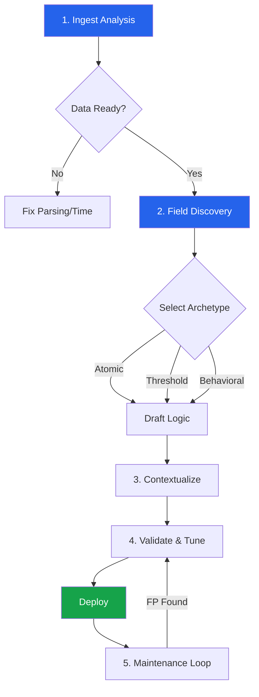

# Detection Engineering & Development Lifecycle (SOP)

This document serves as the **Standard Operating Procedure (SOP)** for engineering high-fidelity detection logic. It is designed to guide Security Engineers through the transition from "Raw Data" to "Production Alert" using a rigorous, data-driven methodology.

**Adherence to Standards:**
*   **Classification:** [MITRE ATT&CK](https://attack.mitre.org/)
*   **Lifecycle:** [MaGMA](https://www.magma-framework.com/) (Management, Growth, Metrics, Assessment)
*   **Documentation:** [Palantir ADS](https://github.com/palantir/alerting-detection-strategy-framework)

## 🔄 The Engineering Workflow


---

## 🏗️ Phase 1: Ingest & Health Analysis (Data Onboarding)
**Objective:** Validate data integrity, timeliness, and completeness *before* logic development begins. "Garbage In, Garbage Out."

### 1.1 Signal Integrity & Ingest Telemetry
**Objective:** Validate that data is not only *present* but *reliable* and *timely*.

**Check 1: Core Signal Integrity**
Before analyzing latency, verify the fundamental parsing:
*   **Host Population:** Is the `host` field correctly extracted?
*   **Timestamp Validity:** Does `_time` reflect the actual event time?

**Check 2: The "Time Travel" Audit (Ingest Latency)**
**Critical Concept:** Real-time alerting requires real-time data. If `_indextime` (Splunk ingest) lags significantly behind `_time` (Event generation), alerts will misfire.

```spl
index=new_source 
| dedup host sourcetype 
| eval rectime=_indextime 
| eval rawlogtime=_time 
| eval diff=(rectime-rawlogtime)/60 
| convert ctime(_indextime) AS indextime 
| rename _time as raw_logs_time, indextime as receiving_time   
| table raw_logs_time receiving_time diff host index sourcetype _raw  
| sort - diff  
| convert ctime(raw_logs_time)
```
*   **Engineering Threshold:** `diff > 10 min` requires pipeline investigation.

### 1.2 Volume Volatility Baseline
**Objective:** Establish a "Normal" event rate to detect sensor failure or flooding (DoS).
```spl
index=new_source 
| timechart span=1h count 
| trendline smg5(count) as moving_avg
```

---

## 🔬 Phase 2: Structural Reconnaissance (The "Raw" Truth)
**Objective:** Map the unknown. Do not trust pre-built parser (TA) extractions blindly. Inspect the `_raw` payload.

### 2.1 The "Field Discovery" Protocol
Use statistical analysis to determine which fields are suitable for **Filtering** (Low Cardinality) vs **Pivoting** (High Cardinality).

**Discovery Query:**
```spl
index=target_source 
| fieldsummary maxvals=10 
| table field, count, distinct_count, max_values 
| search count > 0 
| sort - distinct_count
```

**Interpretation Strategy:**
*   **High Cardinality (>1000):** Likely specific entities (IPs, GUIDs, Hashes). **Use these for Aggregation.**
*   **Low Cardinality (<50):** Likely Enumerables (Status Codes, Event Names, Actions). **Use these for Baselining.**

### 2.2 Deep Structure Extraction
For complex payloads (JSON/XML) that are not automatically parsed:
*   **JSON:** `| spath input=message path=nested.field output=my_field`
*   **Unstructured:** Use `rex` sparingly. Prefer `TERM()` optimization where possible.

---

## 🧠 Phase 3: Logic Construction (Universal Archetypes)
**Objective:** Apply specific *logic patterns* to raw data to extract threats. Almost every detection rule corresponds to one of these **5 Universal Archetypes**.

### 3.1 Archetype A: The "Atomic" Match (Signature)
**Concept:** A single event is inherently bad. No context needed.
*   *Examples:* Malware hash, "Access Denied" by root, production DB drop.
*   **SPL Pattern:**
    ```spl
    index=firewall action=blocked threat_severity=critical
    | eval severity="CRITICAL"
    ```

### 3.2 Archetype B: The "Threshold" Breach (Volumetric)
**Concept:** A normal event becomes malicious when repeated frequently.
*   *Examples:* Brute force (4625), port scanning, mass file access.
*   **SPL Pattern:**
    ```spl
    index=web status=403
    | bin _time span=5m 
    | stats count by src_ip 
    | where count > 50  # The Magic Number (tune via baseline)
    ```

### 3.3 Archetype C: The "First Seen" (New Value)
**Concept:** An entity appears that has never been seen before.
*   *Examples:* New User Agent, New Admin Account, binary running from Temp.
*   **SPL Pattern (Lookup Approach):**
    ```spl
    # 1. Check current events
    index=network 
    | stats earliest(_time) as current_seen by ssl_subject
    
    # 2. Compare to historical lookup
    | inputlookup append=t known_ssl_subjects.csv
    | stats min(current_seen) as first_seen by ssl_subject
    
    # 3. Filter for recent additions (e.g., last 24h)
    | where first_seen > relative_time(now(), "-24h")
    ```

### 3.4 Archetype D: The "Rare Event" (Long Tail)
**Concept:** Valid but statistically improbable behavior. Malicious activity often hides in the "least frequent" bucket.
*   *Examples:* Rare Parent Process, unique User-Agent in an org.
*   **SPL Pattern:**
    ```spl
    index=os_logs 
    | stats count by process_name 
    | eventstats sum(count) as total_events 
    | eval rarity_score = count / total_events 
    | where rarity_score < 0.001  # Isolate the bottom 0.1%
    ```

### 3.5 Archetype E: The "Sequence" (Correlation)
**Concept:** Event A must be followed by Event B within Time T.
*   *Examples:* Phishing Mail -> PowerShell Execution. New User -> Added to Admin Group.
*   **SPL Pattern (`stats` method - Preferred over `transaction`):**
    ```spl
    index=audit OR index=endpoint
    | eval event_type = case(match(message, "Created User"), "step1", match(message, "Added to Admin"), "step2")
    | stats 
        values(event_type) as steps, 
        min(_time) as start_time, 
        max(_time) as end_time 
        by actor_user
    | where mvfind(steps, "step1") AND mvfind(steps, "step2")
    | eval duration = end_time - start_time
    | where duration < 3600  # Must happen within 1 hour
    ```

### 3.6 Enrichment Strategy (Contextualization)
**Objective:** Add value to the alert. "Who" and "Where" are as important as "What".
*   **Asset Context:** `| lookup asset_db src_ip OUTPUT priority, owner, location`
*   **Identity Context:** `| lookup identity_db user OUTPUT department, manager, risk_score`
*   **Threat Intel:** `| lookup threat_intel_ip ip=src_ip OUTPUT threat_group, confidence`

---

## 🧪 Phase 4: Validation & Performance Engineering
**Objective:** Prove the detection works and is efficient.

### 4.1 Adversary Simulation
Do not wait for a real attack. Simulate it.
*   **Tool:** [Event-Horizon](https://github.com/PrototypePrime/Event_Horizon)
*   **Procedure:** Generate the exact log pattern you expect to catch. Verify your rule triggers.

### 4.2 Job Inspection (Performance Audit)
Use the Splunk Job Inspector to audit your search.
*   **Scan Count vs. Result Count:** A high ratio (e.g., 1,000,000 scanned for 10 results) indicates poor filtering.
    *   *Fix:* Move `index` and `sourcetype` filters to the very start.
    *   *Fix:* Use `TERM(unique_string)` to leverage the lexicon.
*   **lispy:** Check the `lispy` output in Job Inspector to ensure your filters are being pushed down to the indexers.

---

## 🔄 Phase 5: Maintenance & Feedback Loop (Day 2 Ops)
**Objective:** Detect "Silent Failures" and "Detection Drift".

### 5.1 The Tuning Cycle
When a False Positive (FP) is reported:
1.  **Analyze:** Is it a logic flaw (regex too broad) or a business exception (Admin doing authorized work)?
2.  **Tune:** Add the exception to the *Tuning Gate* (Phase 3.1), NEVER strictly hardcode in the base search if possible.
3.  **Validate:** Re-run checking against the last 30 days of data to ensure no True Positives are dropped.

### 5.2 Deprecation Criteria
A rule should be retired if:
*   **Data Source Retired:** The log source no longer exists.
*   **Coverage Overlap:** A new EDR rule covers the same technique with higher fidelity.
*   **Noise Ratio:** The rule generates > 95% False Positives and cannot be tuned further.
